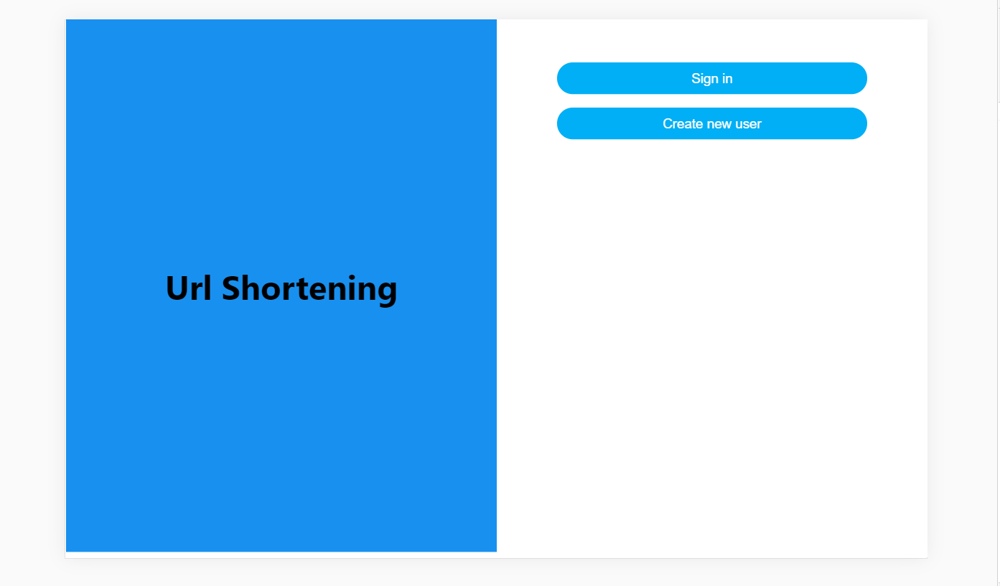
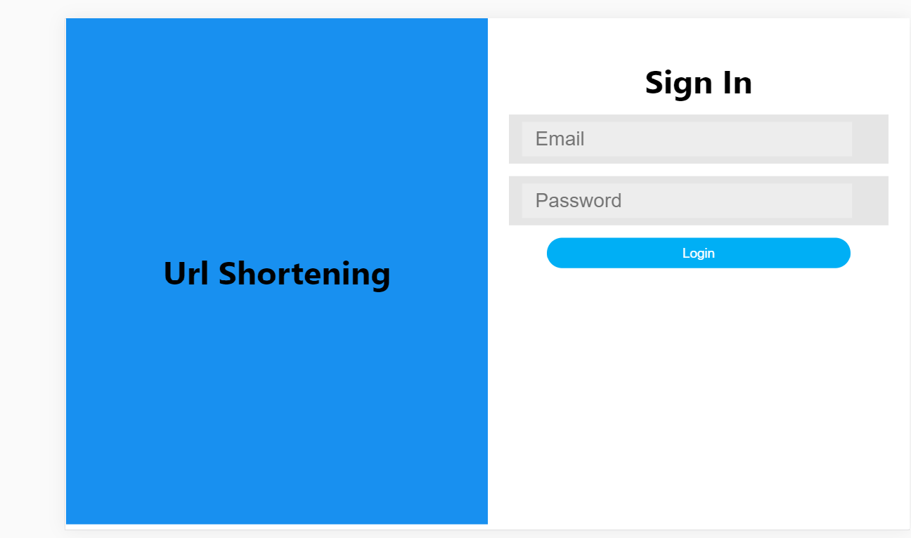
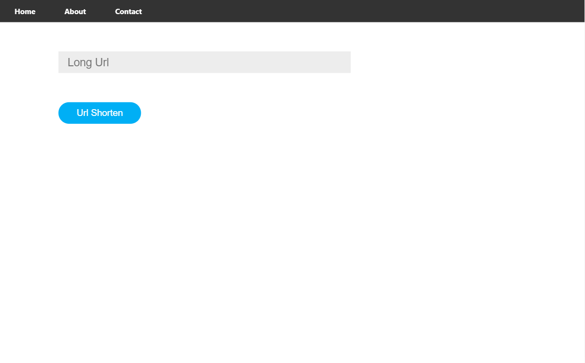
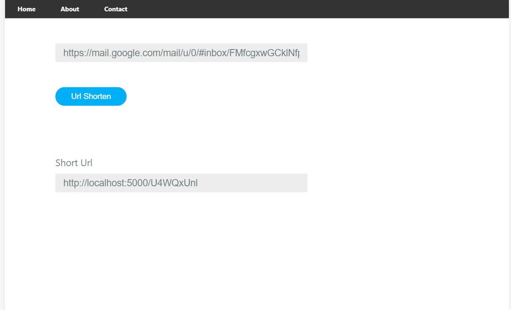

## Application Name
Url-Shortening

## Author:
[Varun](https://github.com/varunprabhakaran22)

## Technology Used:
React, NodeJS, ExpressJs, MongoDB

## Objective:
The main objective of the application is to help the user to shorten any url

## Description

Step1: User should creathe the account.
Step2: Once after creating the account user can sign In with their credentials.
step3: After Successfull login it will redirect to Homepage where user can paste their url
Step4: As a result shorten (short url ) will be created.

## To run this project locally
Clone the project using Git Bash / Command prompt:
git clone : https://github.com/varunprabhakaran22/URL-shortening-service/

### Navigate inside the directory
cd public
## Install all required packages:
npm install
## Run dev server:
npm start

## To start the server
### Navigate inside the directory
cd server
## Install all required packages:
npm install
## Run dev server:
npm start
  
## Screen Shots

## Landing Page

## sign in

## Home Page

## Result

